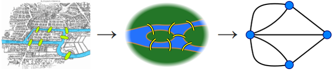
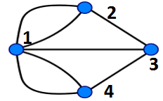
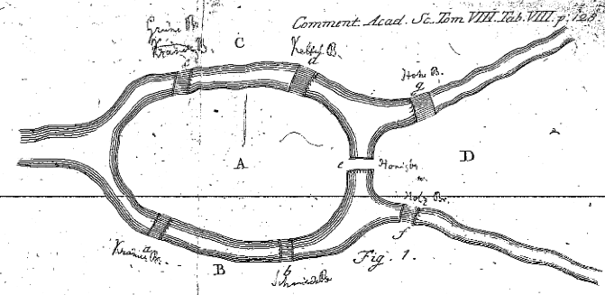
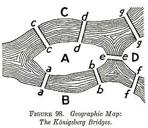
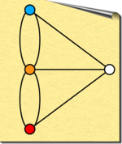

```{r setup, include=FALSE}
knitr::opts_chunk$set(echo = TRUE)
```

# Load packages
The only package we use is `igraph` which is available on CRAN and maintained by Gabor Csardi.

```{r}
#install.packages("igraph",repos="http://cran.us.r-project.org")
library("igraph")
```

# Build a network from scratch
**Functions used in this section:** `rbind()`,`graph_from_edgelist()`

For our introductory example, we are going to follow in Euler's footsteps and create a network for the *Seven Bridges of Konigsberg* 

<center>


</center>

## Edge list approach

We first will work with the undirected version of the network by creating an edge list.  I've labeled the vertices of the network as follows so that they can be more entered into R properly.

<center>

</center>

Edge lists are usually organized in a "From" to "To" way.  However, when there is no direction, all that matters is that all edges are represented.  The edge list for the bridges is as follows:


"FROM"|"TO"
----|----
1|2
1|2
1|3
1|4
1|4
2|3
3|4

```{r EL Build}
bridgeEdgelist<-rbind(c(1,2),c(1,2),c(1,3),c(1,4),c(1,4),c(2,3),c(3,4))
bridgeEdgelist

bridgeGraphEl<-graph_from_edgelist(bridgeEdgelist,directed=FALSE)
plot(bridgeGraphEl)
```

Note** This plot may or may not have a layout that looks like our image above.  We will discuss layouts later in the workshop.

## Adjacency matrix approach
An adjacency matrix approach will utilize a matrix.  The matrix dimensions are 'number of vertices' by 'number of vertices' the columns and rows should be arranged so that the first column and first row correspond to the same vertex, the second column and second row correspond to the same vertex, and so on...

V | 1 | 2 | 3 | 4
---- | ---- | ------ | ----- | -----
**1**  | 0 | 1 | 1 | 1 
**2**  | 1 | 0 | 1 | 0
**3**  | 0 | 0 | 0 | 1
**4**  | 1 | 0 | 0 | 0

```{r ADJ Build}
r1<-c(0,1,1,1)
r2<-c(1,0,1,0)
r3<-c(0,0,0,1)
r4<-c(1,0,0,0)
bridgeAdjmat<-rbind(r1,r2,r3,r4)

bridgeAdjmat

bridgeGraphAm<-graph_from_adjacency_matrix(bridgeAdjmat,mode="plus")
plot(bridgeGraphAm)

```

The `mode="plus"` argument is an option that specifies that the graph be built with multiple edges. For example, if we used `mode="undirected"` instead, the max rule is used, such that the an undirected graph is made with number of edges equal to `max(A(i,j),A(j,i))`, where A is the adjacency matrix. 

Note, if we had created the following, this would have produced the same result as well, using `mode="undirected"`

V | 1 | 2 | 3 | 4
---- | ---- | ------ | ----- | -----
**1**  | 0 | 2 | 1 | 2 
**2**  | 0 | 0 | 1 | 0
**3**  | 0 | 0 | 0 | 1
**4**  | 0 | 0 | 0 | 0

```{r ADJalt Build}
r1<-c(0,2,1,2)
r2<-c(0,0,1,0)
r3<-c(0,0,0,1)
r4<-c(0,0,0,0)
bridgeAdjmatAlt<-rbind(r1,r2,r3,r4)

bridgeAdjmatAlt

bridgeGraphAmAlt<-graph_from_adjacency_matrix(bridgeAdjmatAlt,mode="undirected")
plot(bridgeGraphAmAlt)

```

## Demonstrate the equivalence of the approaches
`igraph` objects are not able to be compared directly using the `==` function. However, we can view and test equivalence of their edge and vertex lists as well as intersect the graphs

### View edge and vertex lists
```{r EQUIV}
## Vertices of graph from adjacency matrix
V(bridgeGraphAm)
## Edge of graph from adjacency matrix
E(bridgeGraphAm)
## Vertices of graph from edge list
V(bridgeGraphEl)
## Edge of graph from edge list
E(bridgeGraphEl)
```

### Test edge and vertex list equivalence 
```{r EQUIV 2}
## Test vertex list equivalence 
V(bridgeGraphAm)==V(bridgeGraphEl)
## Test edge list equivalence 
E(bridgeGraphEl)==E(bridgeGraphAm)
```
### Intersect graphs 
```{r EQUIV Intersect}
## Intersection
bridgeGraphAm %s% bridgeGraphEl

## Created intersected graph and plot
intBridge<-(bridgeGraphAm %s% bridgeGraphEl)
plot(intBridge)
```

## Directionality in Edges

Depending on application, directionality may be important.  Nearly all the `igraph` functions have options to consider direction or not.  Both edge list and adjacency matrix approaches have implicit directionality in their construction.

Assembling the graphs from the edge list and the adjacency matrix using directionality can be achieved using the following:

```{r Directed Graphs}
bridgeGraphElDir<-graph_from_edgelist(bridgeEdgelist,directed=T)
bridgeGraphAmDir<-graph_from_adjacency_matrix(bridgeAdjmat,mode="directed")

```

## CHALLENGE 1: Are these graphs the same? {-}
Using any of the functions/techniques we have used thus far, determine if `bridgeGraphElDir` and `bridgeGraphEl` are equivalent.


# Network attribution

This section is dedicated to storing, calling, and using network attributes assigned to edges and vertices.  

## Vertex attribution

We use the term *attribute* to describe any number of properties or values that can be ascribed to vertices in the network.  Depending on how your network was created, vertices may or may not have attributes already included.  All vertex attributes can be checked by using the `vertex.attributes()` function, supplying the graph name as the argument,

```{r check v attributes}
vertex.attributes(bridgeGraphAm)
```

By default, this function will return all vertex attributes.  The fact that list() is returned signifies that there are no attributes assigned to our vertices, yet.

All vertex attributes are stored and accessed using a `$` between the vertices of the graph of interest and the attribute name, for example `V(graph)$col` will return a vector of colors assigned to the vertices.  The order returned is the order of the vertices in the graph.  

Some *default* attributes of vertices are: `$name`, `$size`, `$col`, these are default in the sense that the plotting routines call use these attributes for visualization by default.

### Vertex Name Assignment
There are many ways to assign attributes to the network.  This demonstrates how to add attributes to an existing network.  

Using Euler's sketch, let's name the vertices:

<center>

</center>

Using Euler's image, we see that our nodes from before are should be renamed as follows, A=1,B=2,C=4,D=3
```{r BRGraph}
## For ease, let's rename the graph from 'bridgeGraphAm' to 'gr'
gr<-bridgeGraphAm
## Call the '$name' attribute
V(gr)$name
## Assign the '$name' attribute
V(gr)$name<-c("A","B","D","C")

## Call the '$name' attribute to verify assignment
V(gr)$name

## Plot to verify assignment
plot(gr)
```

### Vertex Color Assignment

Size and color represent two of the more powerful tools for visualization.  Here we will do a quick color assignment, later we will see more advanced coloring techniques.

How does `'Salmon'` sound?

```{r color nodes}
V(gr)$color<-"salmon"
plot(gr)
```

Vertex assignments are assumed as vectors, if you provide a single value, it is used for all vertices.  Or, as we did above for assigning names, we can provide a vector argument for assignment, where ordering follows node ordering by default.

### Vertex Size Assignment

First, let's assign some different sizes to see how they look.  
```{r size nodes}
V(gr)$size<-1:4
plot(gr)
```

Oh yeah, the default size is 15!  
```{r size nodes 2}
V(gr)$size<-c(15,20,25,30)
plot(gr)
```

Alright, now that we have added some attributes to our graph, lets run that `vertex.attributes()` function again,

```{r vertex attributes check}
vertex.attributes(gr)
```

## Edge attribution
Common edge attributes include `$col`,`$name`, and `$width`.  Just like vertices, edge attributes are accessed by using the format `E(graph)$attribute`.  

We can check what attributes our edges have by using the `edge.attribute()` function,

```{r edge attributes check}
edge.attributes(gr)
```

### Edge Name Assignment
Using what we learned above, let's name the edges in the graph using the following image,

<center>

</center>


Since we know that indexing matters for attribute assignment, we should check what order to specify the edges names vector in.
```{r}
E(gr)
```

Using this information, to specify edge name attributes correctly, we need to use the following,
```{r}
E(gr)$name<-c("a","e","c","b","f","g","d")
```

Verification that we assigned edge names properly is probably easiest just by plotting for this simple graph, so, let's plot the graph again.
```{r}
## Note: Although node labels are plotted by default, edge labels
## need to be specified for plotting
plot(gr,edge.label=E(gr)$name)
```

### Edge Width Assignment

Edge sizes are by default controlled by an attribute called `'width'`. Unlike edge names, width is plotted by default, and the default width is 1.

```{r}
E(gr)$width<-c(.5,1,2,3,4,5,6)
plot(gr,edge.label=E(gr)$name)
```

### Edge Weights

For edges, a common concept and attribute is weight. An edge's weight can represent a variety of things, strength of evdience in the linkage and flow rate (for directed networks) are two examples.  With edge weights defined, shortest path calculations can be modified for application and igraph will call the edge attribute `E(gr)$weight` by default in some functions.

At this point, we will not assign weights to the edges.

<center>


## CHALLENGE 2: Create a custom vertex attribute {-} 
Create a new vertex attribute called `'altcolors'` and use it to give these alternate node color assignments. Plot the graph using the new color attribute by given the plot function the argument `vertex.color=V(gr)$altcolors`

<center>

</center>

To get you started, the following code assigns the color `"white"` to all nodes named `"D"`


```{r Call by name}
# This will initialize the altcolor attribute
V(gr)$altcolor<-"black"
V(gr)$altcolor[which(V(gr)$name=="D")]<-"white"
plot(gr, vertex.color=V(gr)$altcolor)
```

# Visualization and Layouts
There are many options for displaying graphs and networks in igraph.  You may have noticed thus far that each time you have displayed a graph using the default `plot()` command, it changes. This is because the default layout includes a random component.

In this section we will see layout options and other ways to customize visualizations.

## Network Layouts
In `igraph` layouts are a calculation and a series of points for the nodes.  Layouts can be calculated and stored outside of the `plot()` command, or calculated within the `plot()` command.  This approach to layouts also allows for the creation of custom layouts.

Depending on the form of the network, different layouts are more or less effective at showing information.  Let's take a look at 6 different built-in layouts for our small network.

```{r Layouts}
par(mfrow=c(2,3))
plot(gr,layout=layout_in_circle)
plot(gr,layout=layout_on_grid)
plot(gr,layout=layout_randomly)
plot(gr,layout=layout_as_tree)
plot(gr,layout=layout_as_star)
plot(gr,layout=layout_with_gem)

## Randomness in default layout
par(mfrow=c(1,3))
for(i in 1:3){
plot(gr)}
```

It is also informative to look at these layouts in larger networks.  Let's make a random graph and plot it using the same layouts as above.  To make our random network, we will use a Erdos-Renyi approach, where n nodes are randomly connected by m randomly placed edges.

```{r random network layout viz}
g <- erdos.renyi.game(50, 50, type = "gnm")

par(mfrow=c(2,3))
plot(g,layout=layout_in_circle)
plot(g,layout=layout_on_grid)
plot(g,layout=layout_randomly)
plot(g,layout=layout_as_tree)
plot(g,layout=layout_as_star)
plot(g,layout=layout_with_gem)

## Randomness in default layout
par(mfrow=c(1,3))
for(i in 1:3){plot(g)}

```

## Plotting options
There are many things that can be modified for plotting, we have seen a few of these attributes already, such as node color, edge, color, and labels for edges and nodes.  Some options are called by default, such as `V(graph)$color` for node color and `V(graph)$name` for node labels.  

## CHALLENGE 3: An emerging pattern, and likely copyright infringement from creative plotting {-}

Create the following new edge and vertex attributes which you can call for plotting

* Create a new edge attribute `altcolor`, `E(gr)$altcolor` to assign the edges 'a','d','f','g' the color 'red'.  Assign edges 'b','c','e' the color 'white'
    + Here is a hint `E(gr)$altcolor[which(E(gr)$name %in% c('a','d','f','g'))]<-'red'`
* Create a new edge attribute `altwidth`, `E(gr)$altwidth` to assign the red edges ('a','d','f','g') a width of `NA` and a the white edges a width of 10
* Change the background color to `'red'` by using the command `par(bg='red')`
* To finish this task, in the plot command supply the following arguments:
    + `edge.color=E(gr)$altcolor`
    + `edge.width=E(gr)$altwidth`
    + `layout=layout_as_tree`
    + `vertex.shape="none"`
    + `vertex.label.dist=7`
    + `vertex.label.degree=pi/2`
    + `vertex.label.color="white"`
    + `vertex.label.cex=7`
    + `vertex.label=c(NA,NA,"ATARI",NA)`


# Graph Analysis and Associated Visualization
Graphs and networks represent one of the most flexible ways to organize information and relationships.  With that flexibility comes a huge diversity of ways in which they are used to study the information organized within them. Here, we will conduct a couple simple analyses on the graph and then use them for visualization.

## Degree 
Degree is fundamental to the structure of the graph.  It is an attribute of the nodes, and is the number of edges that are connected to a node.

```{r degree}
V(gr)$degree<-degree(gr)
V(gr)$degree
```

Let's visualize the graph based on the degree using size and color.
```{r degree viz}
# Resetting node size and edge width to default
V(gr)$size<-5
E(gr)$width<-1
plot(gr,vertex.size=V(gr)$size*V(gr)$degree)
```

For the color, I will make a color gradient, normalized to maximum degree and make a new attribute called `'degreecolor'`.  

```{r degree viz col}

degree.gradient <- colorRampPalette(c("white","blue","red"))

V(gr)$degreecolor<-degree.gradient(max(V(gr)$degree)+1)[V(gr)$degree+1]
plot(gr,vertex.size=V(gr)$size*V(gr)$degree,vertex.color=V(gr)$degreecolor)
```

Ok, agreed, that isn't very interesting, however, let's see this technique used in a more interesting graph.  Using a random graph , let's create a nice visualization of degree

```{r degree viz random}
g <- erdos.renyi.game(100,150, type = "gnm")
V(g)$degreecolor<-NA
V(g)$size<-5

V(g)$degree<-degree(g)
V(g)$degreecolor<-degree.gradient(max(V(g)$degree)+1)[V(g)$degree+1]
set.seed(1)
layoutfr<-layout_with_fr(g)
plot(g,vertex.size=20*(V(g)$degree/max(V(g)$degree)),vertex.color=V(g)$degreecolor,vertex.label=V(g)$degree,layout=layoutfr)
set.seed(1)
par(bg="black")
plot(g,vertex.size=20*(V(g)$degree/max(V(g)$degree)),vertex.color=V(g)$degreecolor,vertex.label=NA,layout=layoutfr)

```


## Connected Components
Connected components are a way to identify groups in the graph.  Our bridges graph is connected and undirected, so the weak and strong connected components are all the same and are the entire graph.  However, let's do this analysis on the random graph.

```{r cc}
components(g)
```

This analysis returns the number of weakly connected components, the size of each component, and the membership.  We will use membership here to plot the network by components.  Using rainbow colors.

```{r cc viz}
V(g)$component<-components(g)$membership

V(g)$componentcolor<-rainbow(components(g)$no)[V(g)$component]

plot(g, vertex.label=NA,vertex.color=V(g)$componentcolor,layout=layoutfr)
```

## One quick clustering and visualization

Connected components are a structural way to identify clusters or `communities` in a network.  There are other algorithms, one such algorithm is the `cluster_walktrap` approach, which uses random walks from each node to identify communities.

```{r cwt}
cwt<-cluster_walktrap(gr)
membership(cwt)

plot(cwt,gr)

cwtg<-cluster_walktrap(g)
membership(cwtg)

plot(cwtg,g,layout=layoutfr)
```

## Identifying Important Paths

Euler's approach the Konigsberg bridge problem was solved by developing a simple notation for paths.

<center>

</center>

For example, the notation ABAD would represent the path starting at Landmass A, going to B, back to A, and ending on D.  In fact, it was this notation that helped him solve the problem, that and developing the idea of node degree.

Simple paths are those which don't have repeated vertices.  Cycles are paths that begin and end on the same node.  

Let's look at all the simple paths starting at node A and moving to all the other nodes in the bridges graph.

```{r asp}

spsA<-all_simple_paths(gr,V(gr)[which(E(gr)$name=="A")])

## Look at simple path object
spsA[[1]]

## Which nodes are in the specified path?
which(V(gr)%in%spsA[[1]])

## Which edges are in the path?
E(gr,path=spsA[[1]],dir=T)

## Plot the graph with path highlighted
## Set all non-path colors and sizes to a default
V(gr)$spcolor<-"black"
V(gr)$spsize<-5
E(gr)$spcolor<-"black"

## Color and size to highlight paths
V(gr)$spcolor[which(V(gr)%in%spsA[[4]])]<-"blue"
V(gr)$spsize[which(V(gr)%in%spsA[[4]])]<-10
E(gr,path=spsA[[4]],dir=T)$spcolor<-"blue"

plot(gr,vertex.color=V(gr)$spcolor,edge.color=E(gr)$spcolor,vertex.size=V(gr)$spsize)

```

## CHALLENGE 4: Highlight and plot the/a longest simple path from A to the rest of the graph {-}

```{r challenge 4}
# Hint: lengths returns lengths of objects in lists, 'spsA' is a list
lengths(spsA)
## Finds first instance of longest path
which.max(lengths(spsA))

```

## Eccentricity 

We will end this portion of the workshop with perhaps the most difficult graph analysis to say, *eccentricity*.  We discuss eccentricity since it is used to define a couple other measures of a graph, those are the *diameter* and the *radius*.

The eccentricity of a node is the maximum of the shortest distances from each node to each other node in the graph.  The diameter of the graph is the maximum eccentricity, the radius of a graph is the minimum eccentricity.  All three of these functions can be called for an igraph object by using their names as the function names.

```{r eccentricity}
eccentricity(gr)
diameter(gr)
radius(gr)

eccentricity(g)
diameter(g)
radius(g)
```

## FINAL CHALLENGE: Eccentricity {-}

How do the `eccentricity()` values compare to the lengths returned by the `all_simple_paths()` argument? 
Describe in words what the graph diameter and the graph radius are without using the eccentricity.

